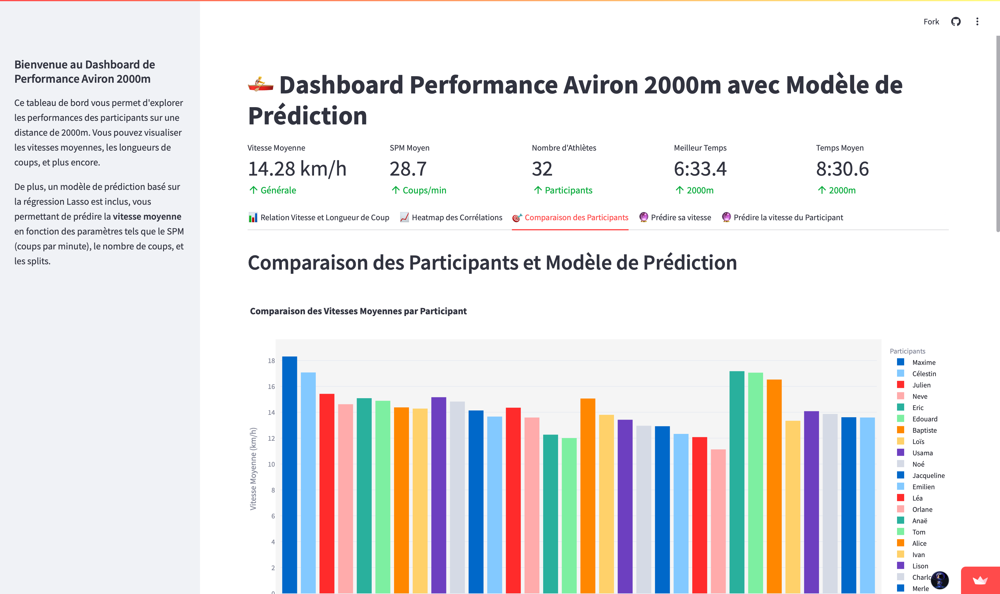

<h1>
Ergometer Competition | SDA 2024
</h1>

<a href="https://avirondashboard.streamlit.app" target="_blank" style="text-decoration: none;">
  

    
    <h2 style="margin: 0; font-size: 2.4em;">⭐ Star du projet : AvironDashboard</h2>
    

      Ce tableau de bord interactif, développé par Johan, propose des analyses avancées des performances de rameurs à l'aide d'un jeu de données sur mesure. Découvrez le projet en direct.
    

  

</a>

## I - Team Information

<a href="https://github.com/Meriadoc-gitgit/ergometer-competition" target="_blank" style="text-decoration: none;">
  

    <h2 style="margin: 0; font-size: 1.8em;">🏆 Projet GitHub : Ergometer Competition</h2>
    

      L'ensemble du code source du projet <b>ergometer-competition</b> est disponible sur mon GitHub. Cliquez ici pour accéder aux détails et au code complet.
    

  

</a>

 

1. Hoang Thuy Duong VU | 12413578
2. Johan GHRE
3. Inès HUMMEL
4. Céline CHEN

## II - Présentation du projet

Le fichier `.zip` joint contient les données recueillies au cours d’une compétition d’ergomètre *(machine à ramer)* → L’ensemble de fichiers sous forme `.json`.

La compétition se déroule comme suit: chaque série comporte 4 rameurs qui vont parcourir 2000m virtuels sur leurs machines. 

>**But**: Être le plus rapide possible sur ces 2000m. 

Les données de chaque série sont enregistrées par les machines et recueillies. 

Les courses ont été paramétrées pour que chaque parcours de 2000m soit divisé en 4 parties de 500m, ie. les stats données par les ergomètres sont calculées et restituées tous les 500m. 

Chaque fichier `.zip` correspond à une série. 

## III - Table of Contents

1. [Requirements](#i---requirements)

2. [Utils](#ii---utils)

3. [Data Preprocessing](#iii---data-preprocessing)
    1. [Schema](#schema)
    2. [Race over 2000m](#race-over-2000m)
        1. [Creation 2000m](#creation-2000m)
        2. [Description 2000m](#description-2000m)

    3. [Race over 500m](#race-over-500m)
        1. [Creation 500m](#creation-500m)
        2. [Description 500m](#description-500m)

4. [Data Exploration](#iv---data-exploration)
    1. [Question 1](#question-1)
    2. [Question 2](#question-2)
    3. [Question 3](#question-3)

5. [Advanced](#v---advanced)
    1. [Classifier](#classifier)
        1. [Classification supervisée](#Classification-supervisée)
        2. [Classification non-supervisée](#Classification-non-supervisée)
    2. [Analyse simple de la fatigue](#Analyse-simple-de-la-fatigue)

## IV - Structure du répertoire 
### Les packages
1. [AvironDashboard](AvironDashboard) : Répertoire github personnel créé par Johan, contenant ses travaux de tous les questions et sa partie avancée.
2. [classifier](classifier) : Étude de la classification supervisée et non-supervisée, écrite par Duong.
    1. [iads](classifier/iads) : Packages de codes sources des classifiers
    2. [supervised.ipynb](classifier/supervised.ipynb) : Notebook d'études des classifiers supervisés
    3. [unsupervised.ipynb](classifier/unsupervised.ipynb)` : Notebook d'études des classifiers non-supervisés
3. [src](src) : Ressources supplémentaires du projet.
    1. [Q1_Q2_Chen_Hummel.html](src/Q1_Q2_Chen_Hummel.html) : Réponses des questions 1 et 2 de Céline et Inès
4. [Test](Test) : Ensemble des bases de données
### Autres fichiers
1. [main.ipynb](main.ipynb) : Notebook principal du projet
2. [rapport_Vu_Ghre_Chen_Hummel.html](rapport_Vu_Ghre_Chen_Hummel.html) : Rapport du projet
3. [readme.md](readme.md) : Fichier de welcome

## V Description de base de données

### Description de la base de 2000m

**Fichier à utiliser** : `Test/ergometer_2000m.json`

|id|Nom de colonnes|Signification|Mesuré en|
|-|-|-|-|
|0|avg_pace|L’allure moyenne du rameur pendant la course, mesurée en minutes et secondes par 500 mètres|`1:59.3` pour une allure de 1 minute et 59,3 secondes par 500m|
|1|calories|Le nombre total de calories brûlées par le participant pendant la course, calculé en fonction de l’effort fourni et de la durée de la course|calories|
|2|distance|La distance totale parcourue par le participant en mètres|mètre|
|3|lane|Le numéro de la ligne attribuée au participant, qui permet d’identifier sa position dans la série de la course|numéro|
|4|logged_time|L’horodatage indiquant le moment où les données ont été enregistrées, souvent sous forme de chaîne de caractères|texte|
|5|participant|Le nom ou l’identifiant du rameur participant à la compétition, stocké sous forme de chaîne de caractères|texte|
|6|place|Le classement final ou la position du rameur à la fin de la course|numéro|
|7|serial_number|Le numéro de série de la machine d’ergomètre utilisée par le participant. Ce numéro permet de tracer chaque machine individuellement|numéro|
|8|splits|Informations concernant les 4 splits de 500m|objet JSON|
|9|spm|Strokes per minute (SPM), c’est-à-dire le nombre de coups de rame par minute. Cela mesure la cadence du rameur pendant la course|coups par minute (SPM)|
|10|time|Le temps total pris par le rameur pour terminer la course, probablement sous forme de chaîne de caractères|format de type HH:MM:SS|

### Description de la base de 500m

**Fichier à utiliser** : 
- Fichier principal : `Test/ergometer_500m.json`
- Fichier à utiliser (recommandé) : `Test/ergometer_500m_norm.json`
- Fichier cumulé : `Test/ergometer_500m_cumule.json`

|id|Nom de colonnes|Signification|Mesuré en|
|-|-|-|-|
|0|split_avg_pace|L'allure moyenne du rameur pendant chaque split, mesurée en minutes et secondes par 500 mètres|`1:59.3` pour une allure de 1 minute et 59,3 secondes par 500m|
|1|split_calories|Le nombre de calories brûlées durant chaque split de 500m, calculé en fonction de l'effort fourni pendant la section de course|calories|
|2|split_distance|La distance parcourue dans chaque split, correspondant à 500m|mètre|
|3|split_drag_factor|Le coefficient de résistance de l'ergomètre pendant chaque split, influençant la difficulté du mouvement|valeur numérique (sans unité)|
|4|split_running_calories|Le cumul des calories brûlées jusqu'à la fin de chaque split|calories|
|5|split_running_distance|Le cumul de la distance parcourue jusqu'à la fin de chaque split|mètre|
|6|split_running_time|Le cumul du temps écoulé jusqu'à la fin de chaque split|format de type HH:MM:SS|
|7|split_stroke_count|Le nombre total de coups de rame effectués dans chaque split de 500m|nombre de coups|
|8|split_stroke_rate|La cadence moyenne de coups de rame par minute durant chaque split|coups par minute (SPM)|
|9|split_time|Le temps total pris pour terminer chaque split|format de type HH:MM:SS|
|10|split_type|Type de split enregistré, indiquant les différentes sections de la course (par ex., 1er split, 2e split, etc.)|texte|
|11|participant|Le nom ou l'identifiant du rameur participant à la compétition, stocké sous forme de chaîne de caractères|texte|

    

## VI - Advanced
Dans ce projet, nous avons structuré notre travail en deux parties. Dans un premier temps, des visualisations interactives ont été réalisées avec **Streamlit**, accompagnées d'analyses statistiques approfondies sur un jeu de données issu d'une compétition d'ergomètres. Ces analyses ont permis de développer des modèles de prédiction pour estimer la vitesse des rameurs à différents intervalles. Vous pouvez accéder directement au jeu de données en cliquant sur le lien ci-joint: [Speed Prediction Game](https://avirondashboard.streamlit.app), ensuite, le code se trouve au répertoire `AvironDashboard`.

Dans un second temps, nous avons implémenté des algorithmes de **classification supervisée**, notamment KNN, Perceptron et arbres de décision, afin de mieux comprendre les performances des participants. En parallèle, des méthodes de **clustering non supervisé**, telles que le clustering hiérarchique et K-means, ont été appliquées pour identifier des groupes de rameurs aux caractéristiques similaires. Enfin, une analyse de la fatigue a été menée pour évaluer ses impacts potentiels sur la performance au cours de la compétition. Les codes se trouvent au répertoire `classifier`.

### Classifier

#### Classification supervisée

>Code source: `classifier/supervised.ipynb`

Après l'étude des trois différents classifieurs, on obtient les résultats suivants  :

||$k$ plus proches voisins|Perceptron|Arbre de décision numérique|
|-|-|-|-|
|Training set|$33.33$|$33.33$|$100$|
|Cross Validation|$38.6 - 0.116$|$35.7 - 0.1464$|$95.7 - 0.065$|
|Test set|$50.94$|$50.94$|$100$|

En partant du tableau ci-dessus, on trouve que l'arbre de décision est le meilleur classifieur, avec l'accuracy moyenne à $95.7$ et la variance la plus basse à $0.065$. De plus, l'accuracy du classifieur en appliquant sur les bases de données d'apprentissage et de test restent $100%$. 

#### Classification non-supervisée

>Code source: `classifier/unsupervised.ipynb`

Dans ce projet, on a implémenté l'algorithme de clustering hiérarchique et l'algorithme de K-moyennes. En général, les programmes marchent parfaitement sur toutes tailles de données et renvoient de bonnes résultats pour l'apprentissage non-supervisé des bases de données dans `Test` concernant la compétition des rameurs. 

Pour l'algorithme des K-moyennes, comme la version de la fonction qui calcule l'inertie n'est pas adaptée pour chaque valeur de K dans l'algorithme de K-moyennes, on va utiliser la classe `KMeans` de la librairie `sklearn.cluster`. Avec l'application de la méthode de coude, on a constaté que $k=4$ est le meilleur nombre de clusters pour effectuer les calculs des K-moyennes. 

Après l'application avec plusieurs valeurs de $k$, dont $k\in\{3,4,5,6\}$, on trouve que $k=4$ renvoit le meilleur taux d'accuracy de $0.5$, tandis que pour les autres valeurs de $k$, les taux d'accuracy varient entre $0.2$ à $0.4$.
    

## Références
- Ghre, Johan. *AvironDashboard*. GitHub, 2024, https://github.com/JohanGhre/AvironDashboard.
- Meriadoc. *Pen-Based Recognition of Handwritten Digits*. GitHub, 2024, https://github.com/Meriadoc-gitgit/pen-based-recognition-of-handwritten-digits.
- AvironDashboard. Streamlit, 2024, https://avirondashboard.streamlit.app.

---
